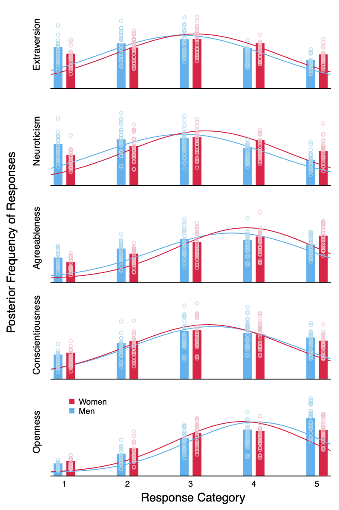

# Bayesian Modeling Approach to Gender Differences in the Big5

This my personal final project for the course Bayesian Modeling where I apply a hierarchical ordinal regression model to data from [Open Psychometrics](https://openpsychometrics.org/_rawdata/). I compare my results to a previous analysis with the widely-used metric model that implicitly assumes equal distances between the Likert-type answers, although the data is ordinal.

This figure compares the metric (normal distributions) to the ordinal regression model (the bars) for men and women. 

  

For detailed methods and results, check out the [report](report.pdf). [Here](big5.R) you find the code, including the stan models.
